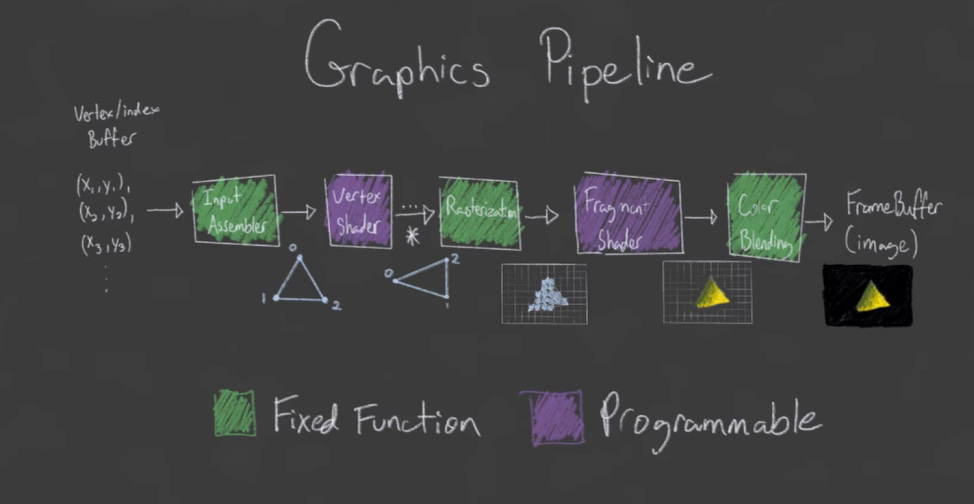

# Build and Run
set up your env for your OS with the [official docs](https://vulkan-tutorial.com/Development_environment)

then run 
```cmake
  make
  make shaders
  make test
```


## Why Vulkan
This has been a learning experience in low level graphics apis and modern c++. 
I started to learn vulkan to create simple graphics for a different project. 
Vulkan quickly proved itself to be overkill and too complicated for my use case, but I enjoyed learning the basics of it nontheless.

As of today I can't dedicate too much time to this project, but I hope to return to it in the future to get it to work as a full 3d engine and learn more about shaders.

In the meantime, making this public for future me to notice.



### Huge Thanks to...
[Brendan Galea](https://www.youtube.com/@BrendanGalea) on youtube, for providing the best out of all the resources I studied to make this little thing.
